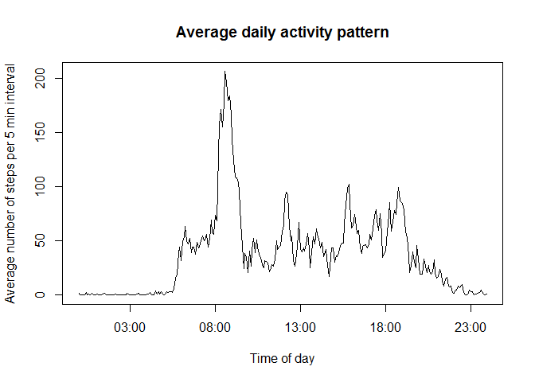

# Reproducible Research: Peer Assessment 1


## Loading and preprocessing the data


```r
if(!file.exists("activity.csv")){unzip("activity.zip")}
activity <- read.csv("activity.csv")
```
This loads a 17568 by 3 data frame into R, with columns "steps," "date" and "interval".

The dates have been read as character strings so let's coerce into a date object:

```r
activity$date <- as.Date(activity$date, "%Y-%m-%d")
```
## What is mean total number of steps taken per day?

First of all, let's calculate the total number of steps on each date, using the **dplyr** package:


```r
library(dplyr)
```

```
## 
## Attaching package: 'dplyr'
```

```
## The following objects are masked from 'package:stats':
## 
##     filter, lag
```

```
## The following objects are masked from 'package:base':
## 
##     intersect, setdiff, setequal, union
```

```r
datetotalsteps <- group_by(activity, date) %>% summarise(totalsteps = sum(steps, na.rm = TRUE))
head(datetotalsteps)
```

```
## # A tibble: 6 × 2
##         date totalsteps
##       <date>      <int>
## 1 2012-10-01          0
## 2 2012-10-02        126
## 3 2012-10-03      11352
## 4 2012-10-04      12116
## 5 2012-10-05      13294
## 6 2012-10-06      15420
```
Let's make a histogram of these data:

```r
library(ggplot2)
```

```
## Warning: package 'ggplot2' was built under R version 3.3.3
```

```r
qplot(totalsteps, data = datetotalsteps, bins = 15, xlab = "Total steps in a day", ylab = "Number of occurrences", main = "Distribution of daily total steps")
```

<!-- -->

So we see the distribution has a peak at about 11,000 steps per day and a second sharp peak at 0, which corresponds to the days when no data was recorded.

Let's calculate the mean and median number of steps per day:

```r
meansteps <- mean(datetotalsteps$totalsteps)
mediansteps <- median(datetotalsteps$totalsteps)
```
Whose output tells us that the mean number of steps per day is 9354.2295082 and the median number of total steps per day is 10395.

## What is the average daily activity pattern?

Let's make a table showing the mean number of steps taken in each 5 minute interval:

```r
intervalsteps <- group_by(activity, interval) %>% summarise(meansteps = mean(steps, na.rm = TRUE))
head(intervalsteps)
```

```
## # A tibble: 6 × 2
##   interval meansteps
##      <int>     <dbl>
## 1        0 1.7169811
## 2        5 0.3396226
## 3       10 0.1320755
## 4       15 0.1509434
## 5       20 0.0754717
## 6       25 2.0943396
```
We can combine these data to make a time series plot. Let's convert "interval" to a POSIXlt so that the times are formatted nicely on the x-axis:

```r
intervalsteps$interval <- as.POSIXlt(
  sprintf("%04d", intervalsteps$interval), # Use sprintf to prepend 0's
  format = "%H%M"
  )
```
Plotting a time series:

```r
with(
  intervalsteps, 
  plot(
    interval, 
    meansteps, 
    type = "l", 
    xlab = "Time of day", 
    ylab = "Average number of steps per 5 min interval", 
    main = "Average daily activity pattern")
  )
```

<!-- -->

By running 

```r
maxtime <- intervalsteps$interval[which(intervalsteps$meansteps == max(intervalsteps$meansteps))]
format(maxtime, "%H:%M")
```

```
## [1] "08:35"
```
we see that the 5 minute interval with maximum activity, on average, is the one starting at 08:35.

## Imputing missing values

Let's find out how many missing values there are. The only observation variable which could have NA values is "steps". We can compute how many NA values there are by running the following R code:

```r
sum(is.na(activity$steps))
```

```
## [1] 2304
```
We can impute the missing values by, for example, replacing them with the median values from the same time interval on the rest of the days.

```r
intervalmedian <- group_by(activity, interval) %>% summarise(mediansteps = median(steps, na.rm = TRUE))

getmedian <- Vectorize(
  function(x){
  subset(intervalmedian, interval==x)[[1,"mediansteps"]]
  }
)

activity2 <- mutate(activity, 
                    steps = ifelse(is.na(steps), 
                                   getmedian(interval), 
                                   steps)
                    )
```
Let's see how this has affected our histogram of the total number of steps per day:


```r
datetotalsteps2 <- group_by(activity2, date) %>% summarise(totalsteps = sum(steps, na.rm = TRUE))
qplot(totalsteps, data = datetotalsteps2, bins = 15, xlab = "Total steps in a day", ylab = "Number of occurrences", main = "Distribution of daily total steps with imputed NA values")
```

<!-- -->

```r
meansteps2 <- mean(datetotalsteps2$totalsteps)
mediansteps2 <- median(datetotalsteps2$totalsteps)
```
With the imputed data, the mean number of steps per day is 9503.8688525 and the median number of steps per day is 10395. So the mean has **increased** slightly by imputing the values, while the median is the **same**.

## Are there differences in activity patterns between weekdays and weekends?

Now we should investigate the effect on the number of steps of whether the data correspond to a *weekday* or a *weekend*. Let's create a new factor variable in the data frame:

```r
activity <- mutate(activity, 
                    daytype = ifelse(
                      weekdays(date) == "Saturday" | weekdays(date) == "Sunday",
                      "weekend",
                      "weekday"
                    )
                  )
```

Let's compute the mean for all daytypes and all intervals.


```r
daytypeintervalsteps <- group_by(activity, interval, daytype) %>% summarise(meansteps = mean(steps, na.rm = TRUE))
# daytypeintervalsteps <- mutate(daytypeintervalsteps, interval = as.POSIXlt(
#  sprintf("%04d", interval), # Use sprintf to prepend 0's
#  format = "%H%M"
#  ))
head(daytypeintervalsteps)
```

```
## Source: local data frame [6 x 3]
## Groups: interval [3]
## 
##   interval daytype meansteps
##      <int>   <chr>     <dbl>
## 1        0 weekday 2.3333333
## 2        0 weekend 0.0000000
## 3        5 weekday 0.4615385
## 4        5 weekend 0.0000000
## 5       10 weekday 0.1794872
## 6       10 weekend 0.0000000
```
We can use the Lattice System to plot two time series for the data, broken down by the factor variable.  

```r
library(lattice)
xyplot(meansteps ~ interval | daytype, 
       data = daytypeintervalsteps, 
       layout = c(1,2), 
       type = "l", 
       xlab = "Interval", 
       ylab = "Number of steps", 
       main = "Average activity pattern on weekdays and weekends"
       )
```

<!-- -->
